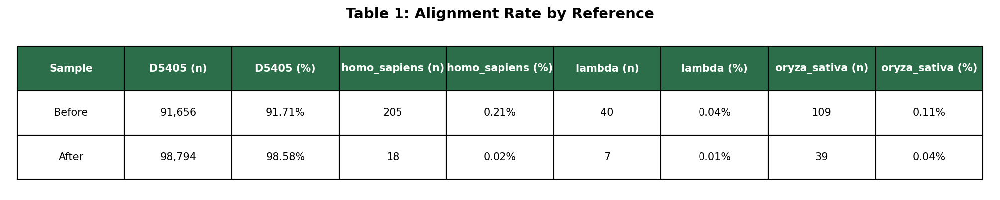
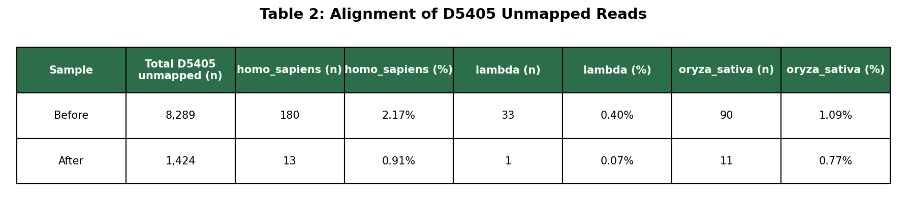
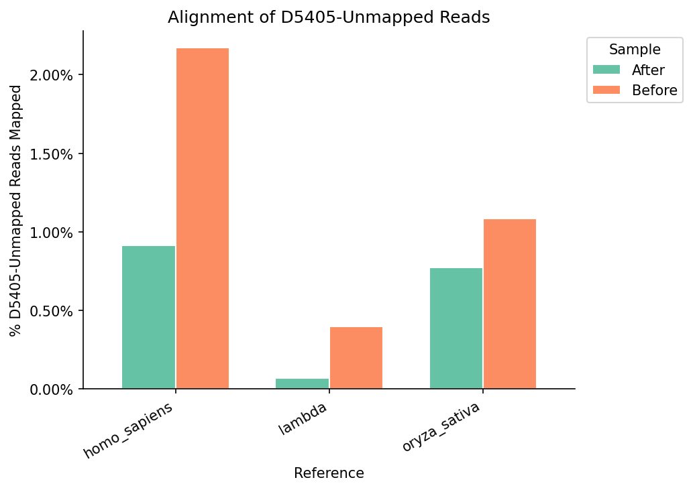

# Results
 
## Background
 
Two unaligned BAM files subsampled to 100,000 reads, that each came from *D5405* barcodes from an ONT multiplexed sequencing run, were analyzed to assess barcode crossover.
 
- `bc_zymo_1b_26-124-0070` — After (improved library prep)
- `bc_zymo_3a_26-124-0051` — Before (original library prep)
 
## Pipeline
 
BAM files were aligned to four reference genomes using dorado:
 
- *D5405* — the expected reference
- *Homo sapiens* (human)
- *Oryza sativa* (rice)
- Lambda phage
  
Reads that did not map to D5405 were extracted and realigned to the other three references to determine whether they were from other species. All alignments were filtered to primary reads with MAPQ ≥ 10 to exclude spurious alignments.
 
## Results
 
### All species mapping
  

 
### Where D5405 unmapped reads mapped
 

 

 
## Conclusion
 
The results indicate barcode crossover occurred in the Before library preparation and was reduced/improved in the After preparation. The Before prep had ~6x more unmapped D5405 reads than the After prep. The After prep shows a much cleaner profile with 98.58% of readsmapping to D5405 and minimal signal in the non-D5405 references.

When those unmapped reads were realigned to human, lambda, and rice, the Before prep consistently mapped at higher rates across all three references: human - 2.17% vs 0.91%, lambda - 0.40% vs 0.07%, rice - 1.09% vs 0.77%.

The pattern is consistent across all three non-D5405 references, supporting the conclusion that barcode crossover occurred in the Before prep and the protocol changes successfully reduced crossover in the After prep.
 
One technical note: There could be additional crossover reads that map to D5405 but originate from another species that would be missed by this approach. However, given the evolutionary distance between the four species, cross-mapping is unlikely. In future iterations, competitive alignment against all references simultaneously or re-mapping the mapped D5405 reads to other species could quantify additional crossover events.
